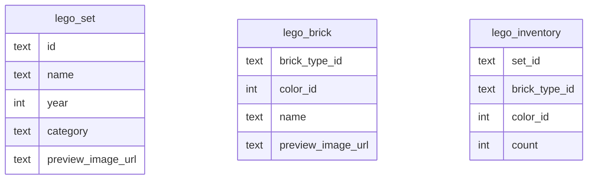
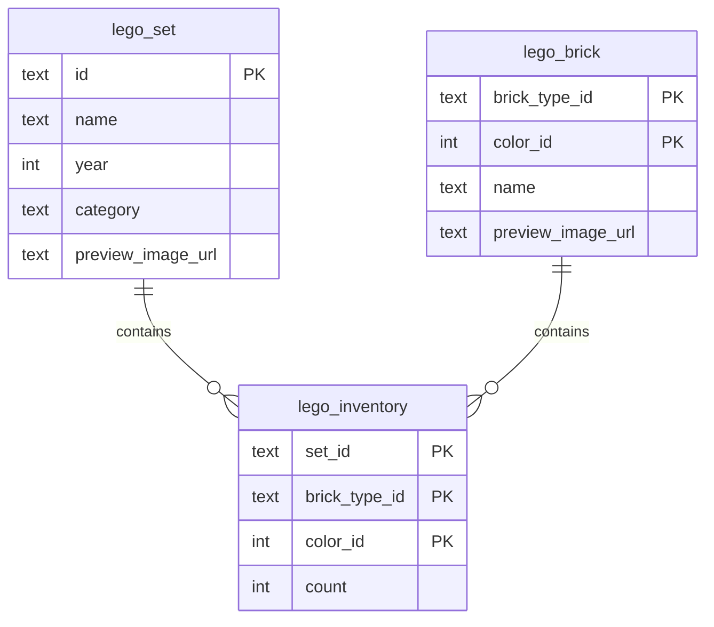

# DAVE3606 — Resource-efficient Programs Project — 2026
> Kine Kragl Engseth - s330526 - kieng6560


<!-- TOC -->
* [DAVE3606 — Resource-efficient Programs Project — 2026](#dave3606--resource-efficient-programs-project--2026)
  * [Design decisions](#design-decisions)
  * [Task 1 — Add database constraints](#task-1--add-database-constraints)
    * [Initial schema](#initial-schema)
    * [Schema interpretation](#schema-interpretation)
    * [Design reasoning](#design-reasoning)
      * [Primary key choices](#primary-key-choices)
      * [Foreign key choices](#foreign-key-choices)
    * [Migration](#migration)
      * [lego_set](#lego_set)
      * [lego_brick](#lego_brick)
      * [lego_inventory](#lego_inventory)
    * [Improved schema](#improved-schema)
  * [Task 2 — Design indexes for flexible queries](#task-2--design-indexes-for-flexible-queries)
    * [SQL for index creation](#sql-for-index-creation)
    * [Query 1 - Single index](#query-1---single-index)
    * [Query 2 - Single index](#query-2---single-index)
    * [Query 3 - Single index](#query-3---single-index)
    * [Query 4 - Single index](#query-4---single-index)
    * [Summary](#summary)
    * [Index re-design](#index-re-design)
    * [Query 1 — Composite index](#query-1--composite-index)
    * [Query 2 — Composite index](#query-2--composite-index)
    * [Query 3 — Composite index](#query-3--composite-index)
    * [Query 4 — Composite index](#query-4--composite-index)
    * [Conclusion](#conclusion)
  * [Task 3 — Algorithmic complexity improvements](#task-3--algorithmic-complexity-improvements)
  * [Task 4 — Encoding, compression, and file handle leaks](#task-4--encoding-compression-and-file-handle-leaks)
    * [Encoding](#encoding)
    * [Compression](#compression)
    * [File handle leaks](#file-handle-leaks)
  * [Task 5 — File formats](#task-5--file-formats)
    * [JSON format implementation](#json-format-implementation)
    * [Custom binary format](#custom-binary-format)
      * [Producer](#producer)
      * [Consumer](#consumer)
      * [Using the custom `.kine` format](#using-the-custom-kine-format)
  * [Task 6 — Frontend and caching](#task-6--frontend-and-caching)
  * [Task 7 — Testing and dependency injection](#task-7--testing-and-dependency-injection)
<!-- TOC -->


## Design decisions

**Design summary**

Compared with the original course starter code, I made a few larger structural changes:
- Introduced an application factory in app/__init__.py and used run.py as the entrypoint
- Replaced repeated database connection code with a dedicated DatabaseSession context manager
- Added a Database helper class to centralize SQL execution
- Moved SQL into queries.py
- Added Makefile commands to simplify setup and execution
- Added tests, tox, and flake8
- Split database setup into a separate db_setup/ area

These changes were mainly made to improve readability, reduce repeated code, and make the project easier to test and maintain.

Any changes to the database environment, such as the container name, host name, port etc. Make the changes in the .env-file.
You do not need to make changes elsewhere. This is the one source of truth for environment loading, and it is not hardcoded anywhere else.


## Task 1 — Add database constraints

- Add primary keys and foreign keys to the database tables and explain the design choices
- Show the SQL statements that you wrote to create the primary keys

### Initial schema



There are no established relations between the tables, even though most of the `lego_inventory` table is derived from the other two tables (`lego_set` and `lego_brick`).

### Schema interpretation

| Table            | One row represents                            | Uniqueness depends on                   | Notes                                                                             |
|------------------|-----------------------------------------------|-----------------------------------------|-----------------------------------------------------------------------------------|
| `lego_set`       | one LEGO set                                  | set identity                            | no two rows should represent the same set                                         |
| `lego_brick`     | one brick variant                             | brick type + brick color                | the same brick type in two separate colors, should be stored as two separate rows |
| `lego_inventory` | one brick variant in one set, with a quantity | set identity + brick color + brick type | relationship table between `lego_set` and `lego_brick` (many-to-many)             |

### Design reasoning

#### Primary key choices

The primary key for this table is straightforward. One row represents one unique LEGO set; therefore, the primary key will be placed on the `id`-column.

For this table, the columns `brick_type_id` and `color_id` are natural candidates for primary keys.

By using (`brick_type_id`, `color_id`) as the primary key, queries searching for by `brick_type_id` will be sped up. Searching by `color_id`, however, will not be sped up by creating that particular primary key.
This is due to how the ordering will be reflected in the index B-tree. The nodes will be sorted by `brick_type_id` primarily. All similar `brick_type_id`-items will be placed together.
Then, secondarily, they will be grouped by their `color_id`. This is due to the lexographical sorting nature, also known as [Leftmost Prefix Rule](https://medium.com/@nitish.weaddo/how-sql-composite-indexes-work-the-leftmost-prefix-rule-and-b-tree-insights-ec2b78326b80).
By using (`color_id`, `brick_type_id`).  as the primary key, the opposite logic will apply. I.e., the nodes will first be grouped together by `color_id`, and then by `brick_type_id`, hence speeding up queries based on `color_id`.

<h5 style="color: pink">lego_inventory — composite primary key</h5>


I am choosing (`set_id`, `brick_type_id`, `color_id`) as the primary key for `lego_inventory`, as it feels like a natural ordering for what the rows should consist of. 
This key will make searches by LEGO sets quick. Searches by the type of brick and the color of the bricks will, however, not be improved and may need their own indices.

#### Foreign key choices

The only table that has a relation to any other table is `lego_inventory`. The foreign key will ensure integrity between the tables, e.g. `lego_inventory` cannot, for instance, use a `set_id` that does not appear in `lego_set`, if there is a foreign key connection between these tables.
I am therefore choosing to do exactly that; I am placing a foreign key on `set_id` with a reference to `lego_set`. 

Likewise, I am placing a foreign key on the columns `brick_type_id` and `color_id` referencing `lego_brick` to ensure that no brick variant appears in `lego_inventory` that does not exist in `lego_brick`.

### Migration

I updated the database by running the following code. It has since been added to the schema for the
database.

#### lego_set
```sql
ALTER TABLE lego_set 
    DROP CONSTRAINT IF EXISTS 
        pk_lego_set;
        
ALTER TABLE lego_set 
    ADD CONSTRAINT pk_lego_set 
        PRIMARY KEY (id);
```

#### lego_brick

```sql
 ALTER TABLE lego_brick 
     DROP CONSTRAINT IF EXISTS
         pk_lego_brick;
        
ALTER TABLE lego_brick
    ADD CONSTRAINT pk_lego_brick
        PRIMARY KEY (brick_type_id, color_id);
```

#### lego_inventory

```sql
ALTER TABLE lego_inventory 
    DROP CONSTRAINT IF EXISTS
        fk_lego_inventory_set;
        
ALTER TABLE lego_inventory 
    DROP CONSTRAINT IF EXISTS
        fk_lego_inventory_brick;
        
ALTER TABLE lego_inventory 
    DROP CONSTRAINT IF EXISTS
        pk_lego_inventory;
        
ALTER TABLE lego_inventory
    ADD CONSTRAINT pk_lego_inventory
        PRIMARY KEY (set_id, brick_type_id, color_id);
        
ALTER TABLE lego_inventory
    ADD CONSTRAINT fk_lego_inventory_set
        FOREIGN KEY (set_id)
            REFERENCES lego_set(id);
        
ALTER TABLE lego_inventory
    ADD CONSTRAINT fk_lego_inventory_brick
        FOREIGN KEY (brick_type_id, color_id)
            REFERENCES lego_brick(brick_type_id, color_id);
```

### Improved schema




## Task 2 — Design indexes for flexible queries

- Create the indexes that are needed to answer queries such as:
    1) > Which LEGO sets contain a specific brick type, regardless of color?
    2) > Which LEGO sets contain bricks of a specific color, regardless of type?
       
- Show the SQL statements for creating the indexes in the report. 

The task asks us to speed up searches by specific brick types, and by specific color (with information about LEGO sets included).
Considering that this task asks for the combination of bricks and sets and colors, we are primarily dealing with the `lego_inventory` table. 
The primary key created in task 1 was placed leftmost on `set_id`, thus the index resulting from the primary key creation is not going to be of much help in these search patterns. 

I am creating a few queries to test the efficiency of these query patterns. I am making sure not to use any join operations, as that can affect performance based on the type of join operation.
I am using the [EXPLAIN command](https://momjian.us/main/writings/pgsql/optimizer.pdf) `EXPLAIN ANALYZE` operations in PostgreSQL to get a better overview of what happens "behind the scenes".

I have chosen queries that includes `set_id` as I can imagine most queries would be interested in this attribute, and not just color or brick by itself. This way, the results will be more realistic.


### SQL for index creation

There is a file called `task2_indexes.py"` where these index creations can be found.

Creating an index on `brick_type_id` in the table `lego_inventory`

```sql
    DROP INDEX IF EXISTS bricktype_idx;
        
    CREATE INDEX bricktype_idx
        ON lego_inventory(brick_type_id);
```


Creating an index on `color_id` in the table `lego_inventory`

```sql
    DROP INDEX IF EXISTS colorid_idx;

    CREATE INDEX colorid_idx
        ON lego_inventory(color_id);
```


### Query 1 - Single index

```sql
EXPLAIN ANALYZE
SELECT DISTINCT set_id, brick_type_id
FROM lego_inventory
WHERE brick_type_id = '3011';
```

**Result before index**

<details>
  <summary>Click to view full query plan </summary>

```text
                                                                    QUERY PLAN                                                                    
--------------------------------------------------------------------------------------------------------------------------------------------------
 Unique  (cost=15053.37..15348.41 rows=2227 width=12) (actual time=458.665..462.952 rows=926.00 loops=1)
   Buffers: shared hit=28 read=7800
   ->  Gather Merge  (cost=15053.37..15342.21 rows=2480 width=12) (actual time=458.663..461.877 rows=2610.00 loops=1)
         Workers Planned: 2
         Workers Launched: 2
         Buffers: shared hit=28 read=7800
         ->  Sort  (cost=14053.35..14055.93 rows=1033 width=12) (actual time=444.616..444.733 rows=870.00 loops=3)
               Sort Key: set_id
               Sort Method: quicksort  Memory: 52kB
               Buffers: shared hit=28 read=7800
               Worker 0:  Sort Method: quicksort  Memory: 51kB
               Worker 1:  Sort Method: quicksort  Memory: 51kB
               ->  Parallel Seq Scan on lego_inventory  (cost=0.00..14001.63 rows=1033 width=12) (actual time=0.524..441.746 rows=870.00 loops=3)
                     Filter: (brick_type_id = '3011'::text)
                     Rows Removed by Filter: 399106
                     Buffers: shared read=7752
 Planning:
   Buffers: shared read=3
 Planning Time: 0.688 ms
 Execution Time: 464.681 ms
(20 rows)
```
</details>

```text
Time: 467.259 ms
```

**Result after index**

<details>
  <summary>Click to view full </summary>

```text
                                                              QUERY PLAN                                                              
--------------------------------------------------------------------------------------------------------------------------------------
 HashAggregate  (cost=5254.07..5276.34 rows=2227 width=12) (actual time=91.810..91.964 rows=926.00 loops=1)
   Group Key: set_id
   Batches: 1  Memory Usage: 121kB
   Buffers: shared read=446
   ->  Bitmap Heap Scan on lego_inventory  (cost=31.65..5247.87 rows=2480 width=12) (actual time=1.054..88.782 rows=2610.00 loops=1)
         Recheck Cond: (brick_type_id = '3011'::text)
         Heap Blocks: exact=441
         Buffers: shared read=446
         ->  Bitmap Index Scan on bricktype_idx  (cost=0.00..31.03 rows=2480 width=0) (actual time=0.550..0.551 rows=2610.00 loops=1)
               Index Cond: (brick_type_id = '3011'::text)
               Index Searches: 1
               Buffers: shared read=5
 Planning:
   Buffers: shared hit=7 read=11
 Planning Time: 2.350 ms
 Execution Time: 92.080 ms
(16 rows)
```
</details>

```text
Time: 95.601 ms
```


### Query 2 - Single index

```sql
EXPLAIN ANALYZE
SELECT DISTINCT set_id, brick_type_id
FROM lego_inventory
WHERE brick_type_id = '4209';
```

**Result before index**

<details>
  <summary>Click to view full query plan</summary>

```text
                                                                   QUERY PLAN                                                                   
------------------------------------------------------------------------------------------------------------------------------------------------
 Unique  (cost=15002.86..15015.47 rows=106 width=12) (actual time=438.524..443.298 rows=55.00 loops=1)
   Buffers: shared hit=29 read=7799
   ->  Gather Merge  (cost=15002.86..15015.20 rows=106 width=12) (actual time=438.523..443.281 rows=57.00 loops=1)
         Workers Planned: 2
         Workers Launched: 2
         Buffers: shared hit=29 read=7799
         ->  Sort  (cost=14002.83..14002.94 rows=44 width=12) (actual time=419.705..419.708 rows=19.00 loops=3)
               Sort Key: set_id
               Sort Method: quicksort  Memory: 25kB
               Buffers: shared hit=29 read=7799
               Worker 0:  Sort Method: quicksort  Memory: 25kB
               Worker 1:  Sort Method: quicksort  Memory: 25kB
               ->  Parallel Seq Scan on lego_inventory  (cost=0.00..14001.63 rows=44 width=12) (actual time=18.187..419.098 rows=19.00 loops=3)
                     Filter: (brick_type_id = '4209'::text)
                     Rows Removed by Filter: 399957
                     Buffers: shared read=7752
 Planning Time: 0.278 ms
 Execution Time: 443.355 ms
(18 rows)
```
</details>

```text
Time: 444.639 ms
```

**Result after index**

<details>
  <summary>Click to view full query plan</summary>

```text
                                                               QUERY PLAN                                                               
----------------------------------------------------------------------------------------------------------------------------------------
 Unique  (cost=396.95..397.48 rows=106 width=12) (actual time=28.144..28.168 rows=55.00 loops=1)
   Buffers: shared read=55
   ->  Sort  (cost=396.95..397.22 rows=106 width=12) (actual time=28.142..28.148 rows=57.00 loops=1)
         Sort Key: set_id
         Sort Method: quicksort  Memory: 26kB
         Buffers: shared read=55
         ->  Bitmap Heap Scan on lego_inventory  (cost=5.25..393.39 rows=106 width=12) (actual time=0.568..27.953 rows=57.00 loops=1)
               Recheck Cond: (brick_type_id = '4209'::text)
               Heap Blocks: exact=52
               Buffers: shared read=55
               ->  Bitmap Index Scan on bricktype_idx  (cost=0.00..5.22 rows=106 width=0) (actual time=0.107..0.107 rows=57.00 loops=1)
                     Index Cond: (brick_type_id = '4209'::text)
                     Index Searches: 1
                     Buffers: shared read=3
 Planning Time: 0.387 ms
 Execution Time: 28.212 ms
(16 rows)
```

</details>

```text
Time: 29.220 ms
```

### Query 3 - Single index

```sql
EXPLAIN ANALYZE
SELECT DISTINCT set_id, color_id
FROM lego_inventory
WHERE color_id = 95;
```

**Result before index**

<details>
  <summary>Click to view full query plan</summary>

```text
                                                                  QUERY PLAN                                                                  
----------------------------------------------------------------------------------------------------------------------------------------------
 HashAggregate  (cost=15756.03..15810.12 rows=5409 width=11) (actual time=333.693..335.666 rows=3252.00 loops=1)
   Group Key: set_id
   Batches: 1  Memory Usage: 281kB
   Buffers: shared read=7752
   ->  Gather  (cost=1000.00..15737.63 rows=7360 width=11) (actual time=101.246..327.254 rows=7218.00 loops=1)
         Workers Planned: 2
         Workers Launched: 2
         Buffers: shared read=7752
         ->  Parallel Seq Scan on lego_inventory  (cost=0.00..14001.63 rows=3067 width=11) (actual time=92.052..318.208 rows=2406.00 loops=3)
               Filter: (color_id = 95)
               Rows Removed by Filter: 397570
               Buffers: shared read=7752
 Planning Time: 0.989 ms
 Execution Time: 336.067 ms
(14 rows)
```

</details>

```text
Time: 338.960 ms
```

**Result after index**

<details>
  <summary>Click to view full query plan</summary>

```text
                                                              QUERY PLAN                                                               
---------------------------------------------------------------------------------------------------------------------------------------
 HashAggregate  (cost=8145.64..8199.73 rows=5409 width=11) (actual time=688.167..688.876 rows=3252.00 loops=1)
   Group Key: set_id
   Batches: 1  Memory Usage: 281kB
   Buffers: shared read=2711
   ->  Bitmap Heap Scan on lego_inventory  (cost=85.47..8127.24 rows=7360 width=11) (actual time=12.548..669.463 rows=7218.00 loops=1)
         Recheck Cond: (color_id = 95)
         Heap Blocks: exact=2702
         Buffers: shared read=2711
         ->  Bitmap Index Scan on colorid_idx  (cost=0.00..83.63 rows=7360 width=0) (actual time=1.082..1.083 rows=7218.00 loops=1)
               Index Cond: (color_id = 95)
               Index Searches: 1
               Buffers: shared read=9
 Planning Time: 0.171 ms
 Execution Time: 689.151 ms
```

</details>

```text
Time: 690.164 ms
```

### Query 4 - Single index

```sql
EXPLAIN ANALYZE
SELECT DISTINCT set_id, color_id
FROM lego_inventory
WHERE color_id = 4;
```

**Result before index**

<details>
  <summary>Click to view full query plan</summary>

```text

                                                                  QUERY PLAN                                                                  
----------------------------------------------------------------------------------------------------------------------------------------------
 HashAggregate  (cost=16739.93..16827.63 rows=8770 width=11) (actual time=397.521..399.513 rows=3974.00 loops=1)
   Group Key: set_id
   Batches: 1  Memory Usage: 409kB
   Buffers: shared read=7752
   ->  Gather  (cost=1000.00..16697.53 rows=16959 width=11) (actual time=69.161..383.423 rows=15688.00 loops=1)
         Workers Planned: 2
         Workers Launched: 2
         Buffers: shared read=7752
         ->  Parallel Seq Scan on lego_inventory  (cost=0.00..14001.63 rows=7066 width=11) (actual time=57.362..373.114 rows=5229.33 loops=3)
               Filter: (color_id = 4)
               Rows Removed by Filter: 394747
               Buffers: shared read=7752
 Planning Time: 0.256 ms
 Execution Time: 400.111 ms
(14 rows)
```

</details>

```text
Time: 401.057 ms
```

**Result after index**

<details>
  <summary>Click to view full query plan</summary>

```text
                                                               QUERY PLAN                                                                
-----------------------------------------------------------------------------------------------------------------------------------------
 HashAggregate  (cost=8198.24..8285.94 rows=8770 width=11) (actual time=888.301..889.339 rows=3974.00 loops=1)
   Group Key: set_id
   Batches: 1  Memory Usage: 409kB
   Buffers: shared read=3438
   ->  Bitmap Heap Scan on lego_inventory  (cost=191.86..8155.85 rows=16959 width=11) (actual time=3.825..861.814 rows=15688.00 loops=1)
         Recheck Cond: (color_id = 4)
         Heap Blocks: exact=3421
         Buffers: shared read=3438
         ->  Bitmap Index Scan on colorid_idx  (cost=0.00..187.62 rows=16959 width=0) (actual time=2.037..2.037 rows=15688.00 loops=1)
               Index Cond: (color_id = 4)
               Index Searches: 1
               Buffers: shared read=17
 Planning Time: 0.470 ms
 Execution Time: 889.875 ms
```

</details>

```text
Time: 891.480 ms
```

### Summary


| Query #                      | Purpose                                | Before | After  | Why it improved                                                                                                                                                                                                                                            |
|------------------------------|----------------------------------------|--------|--------|------------------------------------------------------------------------------------------------------------------------------------------------------------------------------------------------------------------------------------------------------------|
| [1](#query-1---single-index) | Searching by a brick_type_id           | 467 ms | 96 ms  | The index is selective e to reduce the number o that must be read. The database can avoid a full table scan and use-based access path.                                                                                                                     |
| [2](#query-2---single-index) | Searching by a different brick_type_id | 444 ms | 29 ms  | The same reason as above.                                                                                                                                                                                                                                  |
| [3](#query-3---single-index) | Searching by a color_id                | 339 ms | 690 ms | The index on `color_id` is not selective enough. As many rows share the same color, the database still has to fetch a large number of heap pages. This indexed plan turns out to be slower than the parallel sequential scan that was performed initially. |
| [4](#query-4---single-index) | Searching by a different color_id      | 401 ms | 891 ms | Same reason as above.                                                                                                                                                                                                                                      |


### Index re-design

To better reflect the actual query pattern, it might be a good idea to remove the existing indexes and re-create them with a composite that includes `set_id`, as this is what the actual queries (and the task) asks for.

task2_indexes.py has been updated to reflect these changes.

```sql
DROP INDEX IF EXISTS bricktype_idx;
        
CREATE INDEX bricktype_idx
    ON lego_inventory(brick_type_id, set_id);
```

```sql
DROP INDEX IF EXISTS colorid_idx;

CREATE INDEX colorid_idx
    ON lego_inventory(color_id, set_id);
```


### Query 1 — Composite index

```sql
EXPLAIN ANALYZE
SELECT DISTINCT set_id, brick_type_id
FROM lego_inventory
WHERE brick_type_id = '3011';
```

**Result after new index**

<details>
  <summary>Click to view full query plan</summary>

```text
                                                                      QUERY PLAN                                                                     
----------------------------------------------------------------------------------------------------------------------------------------------------
 Unique  (cost=0.43..86.03 rows=2227 width=12) (actual time=0.327..2.046 rows=926.00 loops=1)
   Buffers: shared read=9
   ->  Index Only Scan using bricktype_idx on lego_inventory  (cost=0.43..79.83 rows=2480 width=12) (actual time=0.324..1.171 rows=2610.00 loops=1)
         Index Cond: (brick_type_id = '3011'::text)
         Heap Fetches: 0
         Index Searches: 1
         Buffers: shared read=9
 Planning Time: 0.188 ms
 Execution Time: 2.195 ms
(9 rows)

```
</details>

```text
Time: 8.121 ms
```

### Query 2 — Composite index

```sql
EXPLAIN ANALYZE
SELECT DISTINCT set_id, brick_type_id
FROM lego_inventory
WHERE brick_type_id = '4209';
```

**Result after new index**

<details>
  <summary>Click to view full query plan</summary>

```text
                                                                   QUERY PLAN                                                                   
------------------------------------------------------------------------------------------------------------------------------------------------
 Unique  (cost=0.43..6.55 rows=106 width=12) (actual time=0.169..0.321 rows=55.00 loops=1)
   Buffers: shared read=5
   ->  Index Only Scan using bricktype_idx on lego_inventory  (cost=0.43..6.28 rows=106 width=12) (actual time=0.167..0.244 rows=57.00 loops=1)
         Index Cond: (brick_type_id = '4209'::text)
         Heap Fetches: 0
         Index Searches: 1
         Buffers: shared read=5
 Planning Time: 0.212 ms
 Execution Time: 0.363 ms
(9 rows)
```
</details>

```text
Time: 1.967 ms
```

### Query 3 — Composite index

```sql
EXPLAIN ANALYZE
SELECT DISTINCT set_id, color_id
FROM lego_inventory
WHERE color_id = 95;
```


**Result after new index**

<details>
  <summary>Click to view full query plan</summary>

```text
                                                                    QUERY PLAN                                                                     
---------------------------------------------------------------------------------------------------------------------------------------------------
 Unique  (cost=0.43..191.63 rows=5409 width=11) (actual time=0.389..6.718 rows=3252.00 loops=1)
   Buffers: shared read=22
   ->  Index Only Scan using colorid_idx on lego_inventory  (cost=0.43..173.23 rows=7360 width=11) (actual time=0.386..3.567 rows=7218.00 loops=1)
         Index Cond: (color_id = 95)
         Heap Fetches: 0
         Index Searches: 1
         Buffers: shared read=22
 Planning Time: 0.578 ms
 Execution Time: 7.112 ms
(9 rows)
```

</details>

```text
Time: 11.298 ms
```

### Query 4 — Composite index

```sql
EXPLAIN ANALYZE
SELECT DISTINCT set_id, color_id
FROM lego_inventory
WHERE color_id = 4;
```


**Result after new index**

<details>
  <summary>Click to view full query plan</summary>

```text
                                                                      QUERY PLAN                                                                      
------------------------------------------------------------------------------------------------------------------------------------------------------
 Unique  (cost=0.43..439.61 rows=8770 width=11) (actual time=0.305..32.719 rows=3974.00 loops=1)
   Buffers: shared read=31
   ->  Index Only Scan using colorid_idx on lego_inventory  (cost=0.43..397.21 rows=16959 width=11) (actual time=0.301..25.650 rows=15688.00 loops=1)
         Index Cond: (color_id = 4)
         Heap Fetches: 0
         Index Searches: 1
         Buffers: shared read=31
 Planning Time: 0.311 ms
 Execution Time: 33.306 ms
(9 rows)
```

</details>

```text
Time: 34.533 ms
```


### Conclusion


|           Query #            | Purpose                                | Before index | After single index | Re-design with composite index |
|:----------------------------:|:---------------------------------------|:------------:|:------------------:|:------------------------------:|
| [1](#query-1---single-index) | Searching by a brick_type_id           |    467 ms    |       96 ms        |              8 ms              |
| [2](#query-2---single-index) | Searching by a different brick_type_id |    444 ms    |       29 ms        |              2 ms              |
| [3](#query-3---single-index) | Searching by a color_id                |    339 ms    |       690 ms       |             11 ms              |
| [4](#query-4---single-index) | Searching by a different color_id      |    401 ms    |       891 ms       |             35 ms              |

 ***Why all queries improve with a composite index***

`color_id`/`brick_type_id` was used to filter, and `set_id` was available from the same index. This way, going back into the table was avoided, and the search could be performed using an Index Only Scan, which drastically improved the performance.
A single-column index on `color_id` did not improve performance. 
This shows that index usefulness depends on selectivity and query shape, not only on whether a filtered column is indexed.


## Task 3 — Algorithmic complexity improvements

Running the /sets:
Time to render all sets: 8.774727322990657

Ran it again:
Time to render all sets: 11.497379831998842

The /sets endpoint originally built HTML in an inefficient way. Repeated string concatenation 
inside a loop can lead to quadratic behavior because each concatenation may copy the already-built
string. In practice, that means that generating the full page can become unnecessarily slow when 
many rows are present. This is inefficient because Python strings are immutable. 
That means rows = rows + ... does not modify the existing string in place. 
Instead, Python creates a brand new string each time, copying the old content and adding the 
new content to it. As the string grows larger for every iteration, each new concatenation 
becomes more expensive. The first few concatenations are small, but later ones must copy 
increasingly large strings. 

I changed this by collecting each table row in a list and then using "\n".join(rows) in 
build_rows() inside app/routes_utils.py. This makes the main HTML row-generation step linear in 
the number of rows, because each row string is created once and the final join is performed once.
So the complexity was improved from approximately O(n²) string-building behavior to O(n) for 
the row assembly step.
    
After cleaning up the endpoint:
Time to render all sets: 1.1511313959781546


## Task 4 — Encoding, compression, and file handle leaks

There are no longer any file handle leaks in any of the files. They have all been solved with a 
context manager of some kind. The templates being opened (and not closed) are mostly solved by
using `with open()`, which closes the file handle on `__exit__`.


## Task 5 — File formats

### JSON format implementation

The endpoint /api/set?id=<set_id> returns information about a LEGO set and its inventory as JSON. 
The SQL query joins lego_set, lego_inventory, and lego_brick, and the rows are transformed into a 
structured JSON object.

Example:
```text
{
    "set": {
        "id": "10316-1",
        "name": "Rivendell",
        "year": 2023,
        "category": "Icons"
    },
    "inventory": [
        {
            "brick_type_id": "3001",
            "color_id": 1,
            "name": "Brick 2 x 4",
            "quantity": 12
        }
    ]
}
```

### Custom binary format

I designed a custom binary format, `KINE` (KINE Is Not Encoding), with the extension `.kine`. 
The corresponding reader tool is called `kinecat`, which reads a `.kine` file and prints 
its contents in a human-readable format. It is like `cat`in the UNIX-system, but for `.kine`-files.
*meow* 🐈

The `.kine` format is big-endian, and begins with a 4-byte magic value (KINE) followed by a 1-byte version number. 
Text fields are stored as UTF-8 strings prefixed with a 2-byte unsigned length. 
The set metadata contains id, name, year, and category. The inventory section begins with a 4-byte 
count of inventory rows, followed by repeated inventory records containing brick type id, color id, 
brick name, and quantity. This makes the format easy to validate, extend, and parse sequentially.

#### Producer
- File name: KINE (KINE Is Not Encoding)
- Extension: `.kine`
- Description: a custom binary file format
- Explanation: The flask endpoint creates the binary data

The writer in `kine.py` does this:
* 4 bytes magic header: KINE
* 1 byte version: 1
* set id as:
    * 2-byte length
    * UTF-8 bytes
* set name as:
    * 2-byte length
    * UTF-8 bytes
* year as 2 bytes
* category as:
    * 2-byte length
    * UTF-8 bytes
* inventory count as 4 bytes
* then for each inventory item:
    * brick_type_id as length-prefixed UTF-8 string
    * color_id as length-prefixed UTF-8 string
    * brick name as length-prefixed UTF-8 string
    * quantity as 4 bytes

#### Consumer
<details>
  <Summary>File name: kinecat</Summary>
    Honorable mentions: unkine, dekine, kinedump
</details>

Description: Like `.cat`, but for `.kine` files
Explanation: This app reads the `.kine` binary file and prints the info

#### Using the custom `.kine` format

**1. Download a `.kine` file from the server**

Start the application and open this URL in the browser:

```text
http://127.0.0.1:5000/api/set-binary?id=10316-1
```

This downloads the set in the custom binary format. The response is sent as
paplication/octet-stream and is named `<set_id>.kine`.

**2. Read the file with `kinecat`**

Run it with Python:
```text
python app/kinecat 10316-1.kine
```

## Task 6 — Frontend and caching

I implemented a least-recently-used cache for the /api/set endpoint. The cache stores up to 100 Lego sets, where each 
entry contains both the set metadata and its inventory. When a request arrives, the application first checks whether 
the set id is already in the cache. On a cache hit, the cached result is returned immediately without querying 
the database. On a cache miss, the application queries the database, constructs the JSON response, inserts it into 
the cache, and returns it. When the cache is full, the least recently used entry is evicted. The cache was implemented 
using Python’s OrderedDict, which gives O(1) lookup, update, and eviction.


## Task 7 — Testing and dependency injection

The original code used a global database connection, which makes code harder to test. I refactored the project so that 
database work is performed through a DatabaseSession context manager and a Database helper class.

DatabaseSession is responsible for:
- loading environment variables,
- validating required connection settings,
- opening the psycopg connection,
- committing on success,
- rolling back on failure,
- closing the connection afterwards.

Database is responsible for:
- creating cursors from the active session,
- executing SQL,
- returning one row or all rows through helper methods.

