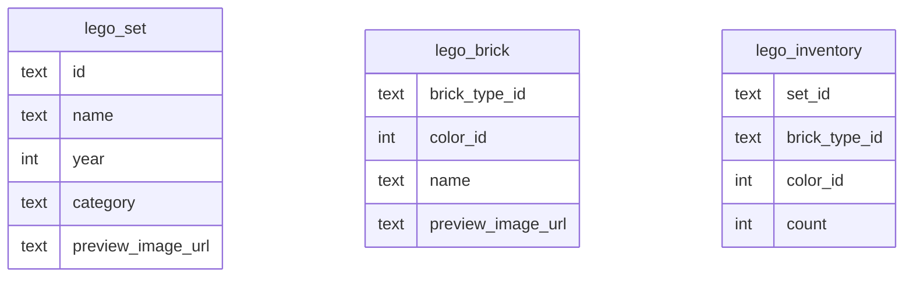
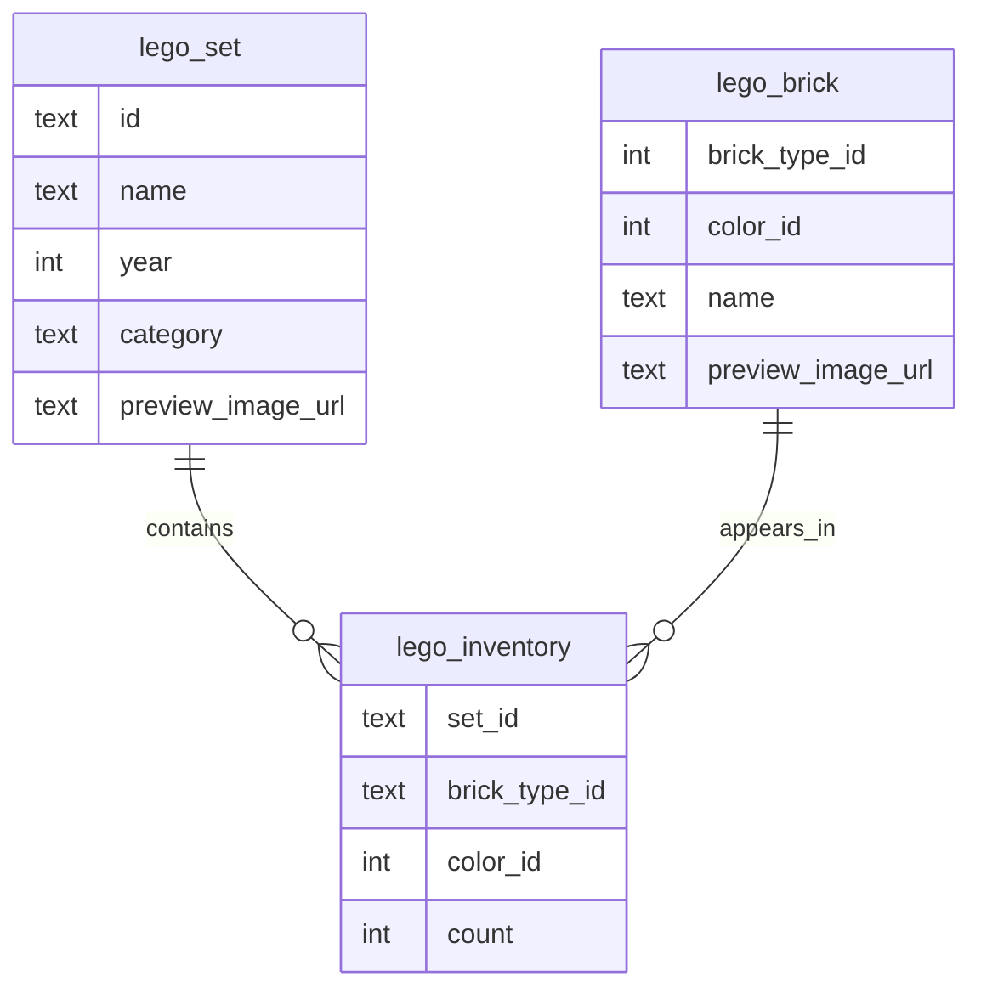

# DAVE3606 — Resource-Efficient Programs Project — 2026
> Kine Kragl Engseth - s330526 - kieng6560

## Table of Content
- [Task 1 — Add database constraints](#task-1--add-database-constraints)
- [Task 2 — Design indexes for flexible queries](#task-2--design-indexes-for-flexible-queries)
- [Task 3 — Algorithmic complexity improvements](#task-3--algorithmic-complexity-improvements)
- [Task 4 — Encoding, compression, and file handle leaks](#task-4--encoding-compression-and-file-handle-leaks)
- [Task 5 — File formats](#task-5--file-formats)
- [Task 6 — Frontend and caching](#task-6--frontend-and-caching)
- [Task 7 — Testing and dependency injection](#task-7--testing-and-dependency-injection)

## Task 1 — Add database constraints

- Add primary keys and foreign keys to the database tables and explain the design choices
- Show the SQL statements that you wrote to create the primary keys

```sql
null
```

### Current database model

The files provided for this project contain three tables:
1) `lego_set`: stores information about Lego sets variants
2) `lego_brick`: stores information about Lego bricks variants
3) `lego_inventory`: stores how many of a given brick variant belong to a given set

### Current schema




### Improved schema




## Task 2 — Design indexes for flexible queries

- Create the indexes that are needed to answer queries such as:
    1) > Which LEGO sets contain a specific brick type, regardless of color?
    2) > Which LEGO sets contain bricks of a specific color, regardless of type?
       
- Show the SQL statements for creating the indexes in the report. 

**Query 1**
```sql
null
```

**Query 2**
```sql
null
```

**Query 3**
```sql
null
```

- Explain why the indexes you added improved the query performance

| Query # | Purpose       | Before | After | Why it improved |
|---------|---------------|--------|-------|-----------------|
| 1       | Blabla reason | 0 ms   | 0 ms  | Bla bla reason  |
| 2       | Blabla reason | 0 ms   | 0 ms  | Blabla reason   |
| 3       | Blabla reason | 0 ms   | 0 ms  | Blabla reason   |


## Task 3 — Algorithmic complexity improvements

- The endpoint http://localhost:5000/sets is quite slow.
  - Analyze the code
  - What time complexity does it have?

## Task 4 — Encoding, compression, and file handle leaks

*No report explanations for this section.*

## Task 5 — File formats

- Design your own binary file format for representing a Lego set and its inventory. Describe the file format in the report.

## Task 6 — Frontend and caching

- Add a server-side cache that stores the 100 most recently requested sets. Explain briefly in the report how the cache works, which eviction policy you chose, and what its complexity is.
- Measure how much time the endpoint spends when the set inventory is cached vs. when it is not.

## Task 7 — Testing and dependency injection

*No report explanations for this section.*
