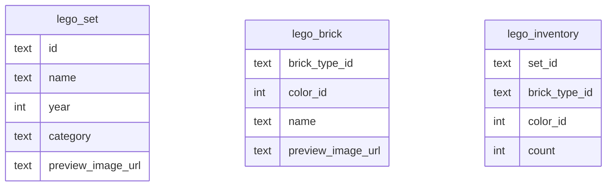
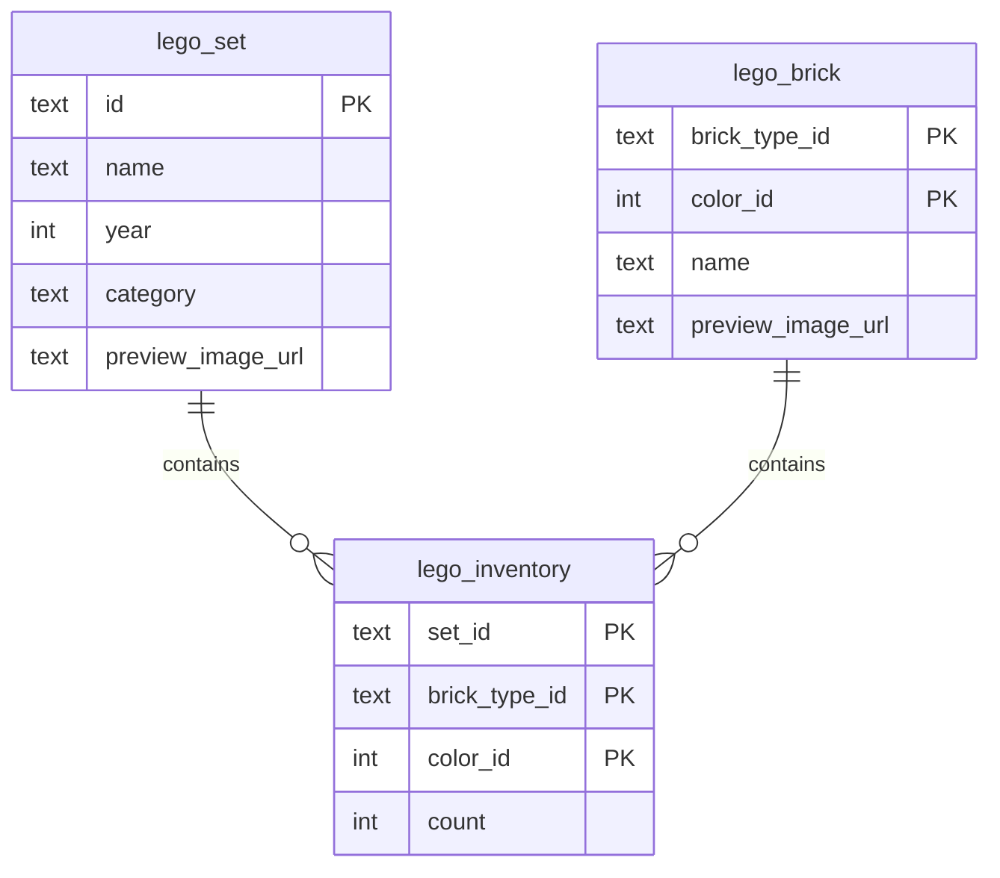

# DAVE3606 — Resource-Efficient Programs Project — 2026
> Kine Kragl Engseth - s330526 - kieng6560


## Table of Content
- [Task 1 — Add database constraints](#task-1--add-database-constraints)
- [Task 2 — Design indexes for flexible queries](#task-2--design-indexes-for-flexible-queries)
- [Task 3 — Algorithmic complexity improvements](#task-3--algorithmic-complexity-improvements)
- [Task 4 — Encoding, compression, and file handle leaks](#task-4--encoding-compression-and-file-handle-leaks)
- [Task 5 — File formats](#task-5--file-formats)
- [Task 6 — Frontend and caching](#task-6--frontend-and-caching)
- [Task 7 — Testing and dependency injection](#task-7--testing-and-dependency-injection)

## Task 1 — Add database constraints

- Add primary keys and foreign keys to the database tables and explain the design choices
- Show the SQL statements that you wrote to create the primary keys

### Initial schema



There are no established relations between the tables, even though most of the `lego_inventory` table is derived from the other two tables (`lego_set` and `lego_brick`).

### Schema interpretation

| Table            | One row represents                            | Uniqueness depends on                   | Notes                                                                             |
|------------------|-----------------------------------------------|-----------------------------------------|-----------------------------------------------------------------------------------|
| `lego_set`       | one Lego set                                  | set identity                            | no two rows should represent the same set                                         |
| `lego_brick`     | one brick variant                             | brick type + brick color                | the same brick type in two separate colors, should be stored as two separate rows |
| `lego_inventory` | one brick variant in one set, with a quantity | set identity + brick color + brick type | relationship table between `lego_set` and `lego_brick` (many-to-many)             |

### Design reasoning

#### Primary key choices

A primary key adds two factors to the attribute candidate for a primary key constraint: uniqueness and not null constraint.
Based on the table above on my [schema interpretation](#schema-interpretation), I am making the following choices for my primary keys:

<h5 style="color: pink">lego_set — simple primary key</h5>
The primary key for this table is straightforward. One row represents one unique Lego set; therefore, the primary key will be placed on the `id`-column.


<h5 style="color: pink">lego_brick — composite primary key</h5>
For this table, the columns `brick_type_id` and `color_id` are natural candidates for primary keys. 
The question is whether to use both as a composite key, and if so: in what order? <br><br>
The general formula for a permutation is:

$$
P(n,r) = \frac{n!}{(n-r)!}
$$


As I am ordering all the columns, r = n, therefore:

$$
P(n,n) = n!
$$

This means that the number of possible combinations for the primary key for `lego_brick` is:

$$
2! = 2
$$

This means that the composite primary key for this table can either of the following: 
- (`brick_type_id`, `color_id`)
- (`color_id`, `brick_type_id`). 

By using the former as the primary key, queries searching for by `brick_type_id` will be sped up. Searching by `color_id`, however, will not be sped up by creating that particular primary key.
This is due to how the ordering will be reflected in the index B-tree. The nodes will be sorted by `brick_type_id` primarily. All similar `brick_type_id`-items will be placed together.
Then, secondarily, they will be grouped by their `color_id`. This is due to the lexographical sorting nature, also known as [Leftmost Prefix Rule](https://medium.com/@nitish.weaddo/how-sql-composite-indexes-work-the-leftmost-prefix-rule-and-b-tree-insights-ec2b78326b80).

By using the latter as the primary key, the opposite logic will apply. I.e., the nodes will first be grouped together by `color_id`, and then by `brick_type_id`, hence speeding up queries based on `color_id`.

<h5 style="color: pink">lego_inventory — composite primary key</h5>

The number of possible permutations for the primary key for this table is:

$$
3! = 6
$$

This means that this table has the following possibilities for the composite primary key:

- (`set_id`, `brick_type_id`, `color_id`)
- (`set_id`, `color_id`, `brick_type_id`)
- (`brick_type_id`, `set_id`, `color_id`)
- (`brick_type_id`, `color_id`, `set_id`)
- (`color_id`, `set_id`, `brick_type_id`)
- (`color_id`, `brick_type_id`, `set_id`)

I am choosing the first option as the primary key for `lego_inventory`, as it feels like a natural ordering for what the rows should consist of. 
This key will make searches by Lego sets quick. Searches by the type of brick and the color of the bricks will, however, not be improved and may need their own indices.

#### Foreign key choices

The only table that has a relation to any other table is `lego_inventory`. The foreign key will ensure integrity between the tables, e.g. `lego_inventory` cannot, for instance, use a `set_id` that does not appear in `lego_set`, if there is a foreign key connection between these tables.
I am therefore choosing to do exactly that; I am placing a foreign key on `set_id` with a reference to `lego_set`. 

Likewise, I am placing a foreign key on the columns `brick_type_id` and `color_id` referencing `lego_brick` to ensure that no brick variant appears in `lego_inventory` that does not exist in `lego_brick`.

### Migration

The migration is saved in a file called task1_constraints.py. 

#### lego_set
```sql
ALTER TABLE lego_set 
        DROP CONSTRAINT IF EXISTS
        pk_lego_set;
        
    ALTER TABLE lego_set
        ADD CONSTRAINT pk_lego_set
        PRIMARY KEY (id);
```

#### lego_brick

```sql

 ALTER TABLE lego_brick 
        DROP CONSTRAINT IF EXISTS
        pk_lego_brick;
        
    ALTER TABLE lego_brick
        ADD CONSTRAINT pk_lego_brick
        PRIMARY KEY (brick_type_id, color_id);

```

#### lego_inventory

```sql

ALTER TABLE lego_inventory 
        DROP CONSTRAINT IF EXISTS
        fk_lego_inventory_set;
        
    ALTER TABLE lego_inventory 
        DROP CONSTRAINT IF EXISTS
        fk_lego_inventory_brick;
        
    ALTER TABLE lego_inventory 
        DROP CONSTRAINT IF EXISTS
        pk_lego_inventory;
        
    ALTER TABLE lego_inventory
        ADD CONSTRAINT pk_lego_inventory
        PRIMARY KEY (set_id, brick_type_id, color_id);
        
    ALTER TABLE lego_inventory
        ADD CONSTRAINT fk_lego_inventory_set
        FOREIGN KEY (set_id)
        REFERENCES lego_set(id);
        
    ALTER TABLE lego_inventory
        ADD CONSTRAINT fk_lego_inventory_brick
        FOREIGN KEY (brick_type_id, color_id)
        REFERENCES lego_brick(brick_type_id, color_id);

```

### Improved schema




## Task 2 — Design indexes for flexible queries

- Create the indexes that are needed to answer queries such as:
    1) > Which LEGO sets contain a specific brick type, regardless of color?
    2) > Which LEGO sets contain bricks of a specific color, regardless of type?
       
- Show the SQL statements for creating the indexes in the report. 

**Query 1**
```sql
null
```

**Query 2**
```sql
null
```

**Query 3**
```sql
null
```

- Explain why the indexes you added improved the query performance

| Query # | Purpose       | Before | After | Why it improved |
|---------|---------------|--------|-------|-----------------|
| 1       | Blabla reason | 0 ms   | 0 ms  | Bla bla reason  |
| 2       | Blabla reason | 0 ms   | 0 ms  | Blabla reason   |
| 3       | Blabla reason | 0 ms   | 0 ms  | Blabla reason   |


## Task 3 — Algorithmic complexity improvements

- The endpoint http://localhost:5000/sets is quite slow.
  - Analyze the code
  - What time complexity does it have?

## Task 4 — Encoding, compression, and file handle leaks

*No report explanations for this section.*

## Task 5 — File formats

- Design your own binary file format for representing a Lego set and its inventory. Describe the file format in the report.

## Task 6 — Frontend and caching

- Add a server-side cache that stores the 100 most recently requested sets. Explain briefly in the report how the cache works, which eviction policy you chose, and what its complexity is.
- Measure how much time the endpoint spends when the set inventory is cached vs. when it is not.

## Task 7 — Testing and dependency injection

*No report explanations for this section.*
