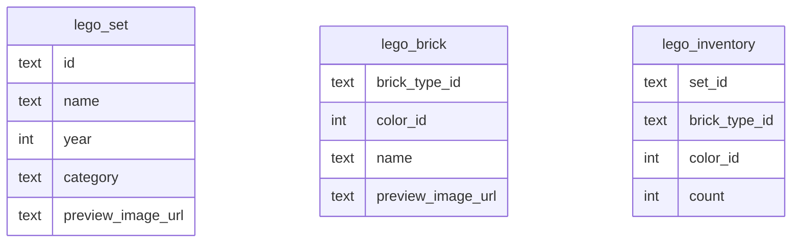
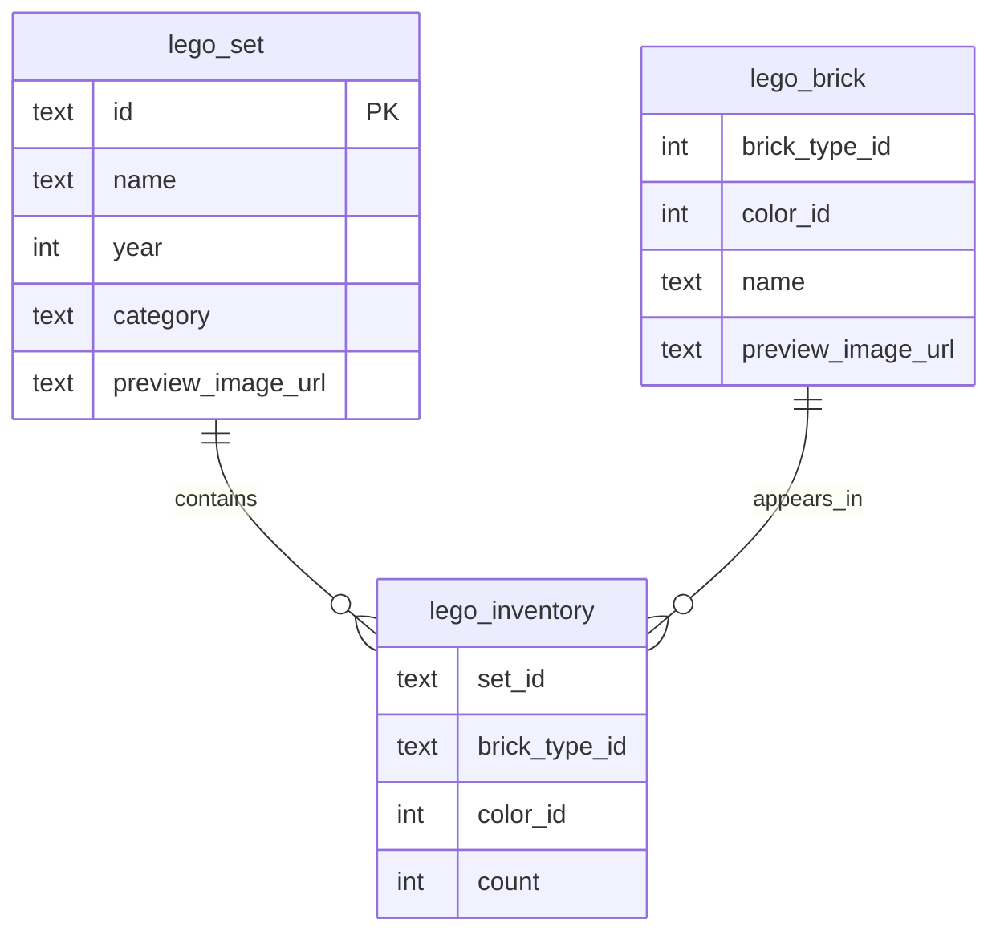

# DAVE3606 — Resource-Efficient Programs Project — 2026
> Kine Kragl Engseth - s330526 - kieng6560

## Table of Content
- [Task 1 — Add database constraints](#task-1--add-database-constraints)
- [Task 2 — Design indexes for flexible queries](#task-2--design-indexes-for-flexible-queries)
- [Task 3 — Algorithmic complexity improvements](#task-3--algorithmic-complexity-improvements)
- [Task 4 — Encoding, compression, and file handle leaks](#task-4--encoding-compression-and-file-handle-leaks)
- [Task 5 — File formats](#task-5--file-formats)
- [Task 6 — Frontend and caching](#task-6--frontend-and-caching)
- [Task 7 — Testing and dependency injection](#task-7--testing-and-dependency-injection)

## Task 1 — Add database constraints

- Add primary keys and foreign keys to the database tables and explain the design choices
- Show the SQL statements that you wrote to create the primary keys

### Initial schema



There are no established relations between the tables, even though most of the `lego_inventory` table is derived from the other two tables (`lego_set` and `lego_brick`).

### Schema interpretation

| Table            | One row represents                            | Uniqueness depends on    | Notes                                                                             |
|------------------|-----------------------------------------------|--------------------------|-----------------------------------------------------------------------------------|
| `lego_set`       | one Lego set                                  | set identity             | no two rows should represent the same set                                         |
| `lego_brick`     | one brick variant                             | brick type + brick color | the same brick type in two separate colors, should be stored as two separate rows |
| `lego_inventory` | one brick variant in one set, with a quantity | N/A                      | relationship table between `lego_set` and `lego_brick` (many-to-many)             |

### Design reasoning

#### Primary key choices

A primary key adds two factors to the attribute candidate for a primary key constraint: 
- uniqueness
- not null constraint.

To make solid choices for the primary keys, it is important to identity what uniqueness means for the different tables.

For my models, I want one row to represent:

`lego_set`: one single Lego set. 
No two rows should exist and be the same set.

`lego_brick`: one specific brick type combined with one specific color.
This means that `brick_type` A in the color purple, and `brick_type` A in the color blue, should represent two separate rows in the table. 


`lego_inventory`

This means that the primary key for table blablab is blabla.


#### Foreign key choices

### Migration

```sql
null
```

### Improved schema




## Task 2 — Design indexes for flexible queries

- Create the indexes that are needed to answer queries such as:
    1) > Which LEGO sets contain a specific brick type, regardless of color?
    2) > Which LEGO sets contain bricks of a specific color, regardless of type?
       
- Show the SQL statements for creating the indexes in the report. 

**Query 1**
```sql
null
```

**Query 2**
```sql
null
```

**Query 3**
```sql
null
```

- Explain why the indexes you added improved the query performance

| Query # | Purpose       | Before | After | Why it improved |
|---------|---------------|--------|-------|-----------------|
| 1       | Blabla reason | 0 ms   | 0 ms  | Bla bla reason  |
| 2       | Blabla reason | 0 ms   | 0 ms  | Blabla reason   |
| 3       | Blabla reason | 0 ms   | 0 ms  | Blabla reason   |


## Task 3 — Algorithmic complexity improvements

- The endpoint http://localhost:5000/sets is quite slow.
  - Analyze the code
  - What time complexity does it have?

## Task 4 — Encoding, compression, and file handle leaks

*No report explanations for this section.*

## Task 5 — File formats

- Design your own binary file format for representing a Lego set and its inventory. Describe the file format in the report.

## Task 6 — Frontend and caching

- Add a server-side cache that stores the 100 most recently requested sets. Explain briefly in the report how the cache works, which eviction policy you chose, and what its complexity is.
- Measure how much time the endpoint spends when the set inventory is cached vs. when it is not.

## Task 7 — Testing and dependency injection

*No report explanations for this section.*
